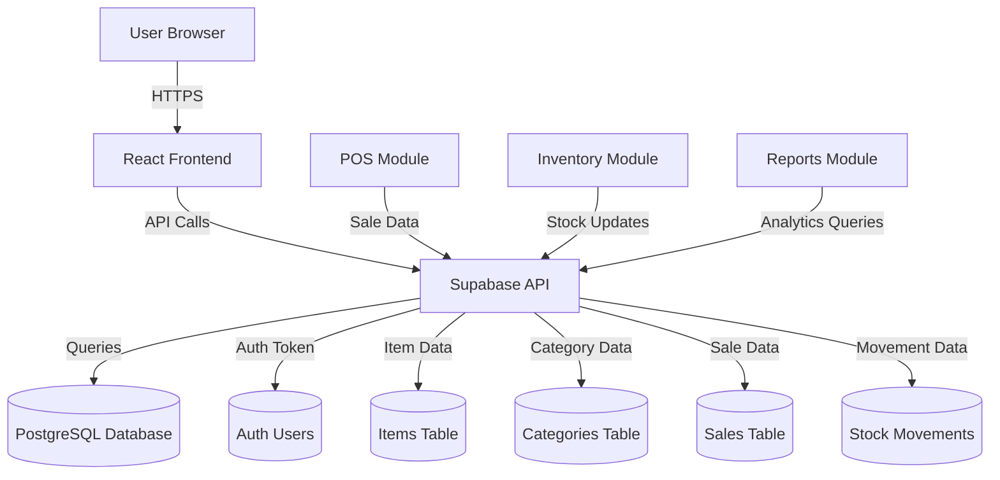
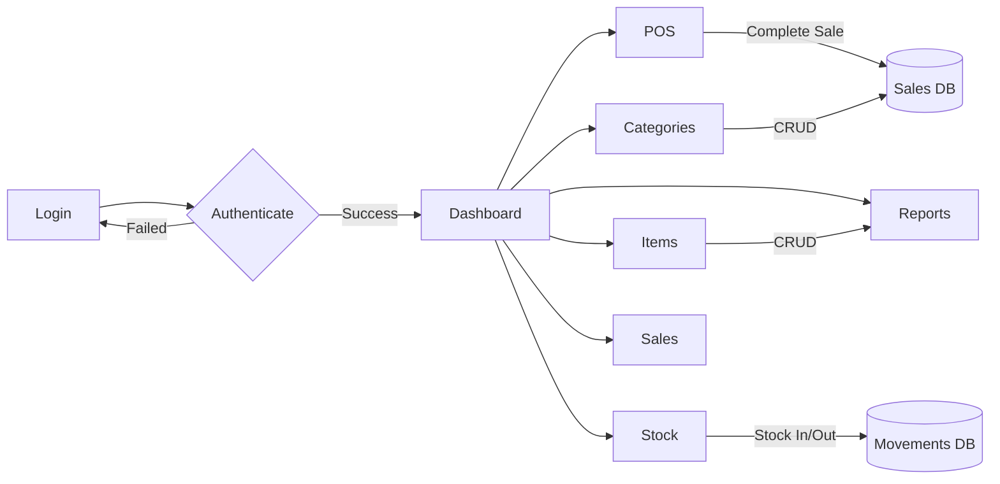
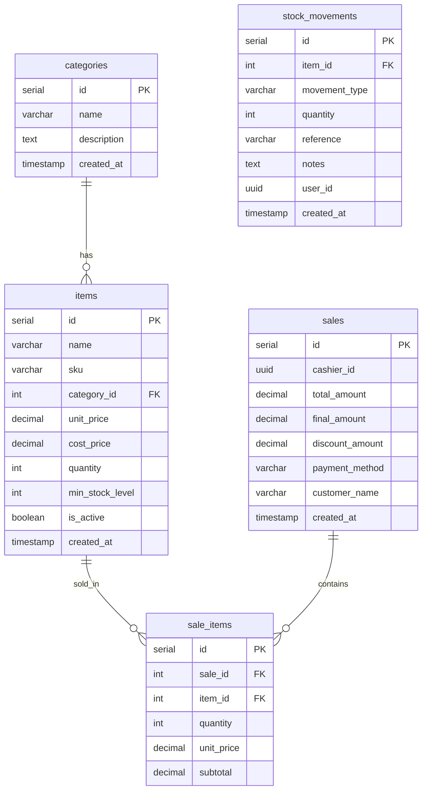

# Pawin PyPOS - University Stationery Inventory & POS System


A modern Point of Sale and Inventory Management System designed for university stationery stores, built with React and Supabase.

## 🔗 Links

- **Live Demo**: [Pawin PyPOS](https://pawin-pypos.vercel.app)
- **GitHub Repository**: [github.com/pawinplc/Pawin-PyPOS](https://github.com/pawinplc/Pawin-PyPOS)

## ✨ Features

### Core Features
- **Point of Sale (POS)** - Fast checkout with cart management, customer payment tracking, and change calculation
- **Inventory Management** - Track stock levels, stock movements (in/out/adjustments)
- **Categories Management** - Organize items by category with CSV/XLS import/export
- **Items Management** - Full CRUD operations with SKU tracking, bulk import/export
- **Sales History** - View all transactions with detailed receipts
- **Reports** - Daily, weekly, monthly, yearly sales reports with export functionality
- **Stock Alerts** - Low stock notifications to prevent stockouts
- **Dark/Light Mode** - User preference with theme toggle
- **Responsive Design** - Works on desktop and mobile devices

### Special Features
- **Stationery Services** - Printing & Scanning services section in POS
- **Multi-period Sales View** - Filter sales by Today, This Week, This Month, This Year
- **Notification System** - Real-time alerts for low stock and important events
- **Calculator Integration** - Customer payment calculation with change display
- **Export Reports** - Export sales data to Excel with proper formatting

## 🛠️ Technology Stack

### Frontend
| Technology | Version | Purpose |
|------------|---------|---------|
| React | 18.x | UI Framework |
| Vite | 5.x | Build Tool |
| React Router | 6.x | Client-side Routing |
| Supabase JS | 2.x | Backend as a Service |
| XLSX | Latest | Excel Export |
| React Hot Toast | Latest | Notifications |

### Backend & Database
| Technology | Purpose |
|-----------|---------|
| Supabase | PostgreSQL Database + Auth + Storage |
| PostgreSQL | Relational Database |

### Design & Icons
| Technology | Purpose |
|-----------|---------|
| Tabler Icons | Icon Library |
| Google Fonts (Poppins) | Typography |
| CSS Variables | Theme System |

## 📊 System Architecture

### Data Flow



### User Flow



## 📁 Database Schema



## 🎯 Module Descriptions

### 1. Dashboard
- Overview of system statistics
- Recent sales widget
- Low stock alerts
- Quick action buttons

### 2. Point of Sale (POS)
- Service items display (Printing/Scanning)
- Product grid with category filtering
- Shopping cart with quantity management
- Customer payment input
- Change calculation display
- Receipt generation

### 3. Items Management
- Add/Edit/Delete items
- SKU tracking (Stock Keeping Unit)
- Category assignment
- Price and stock management
- CSV/XLS import functionality
- Export to Excel

### 4. Categories Management
- Create/Edit/Delete categories
- Items count per category
- CSV import support

### 5. Stock Management
- Stock In operations (receive inventory)
- Stock Out operations (dispatch inventory)
- Stock Adjustments (corrections)
- Movement history tracking
- Stock status indicators (In Stock/Low Stock/Out of Stock)

### 6. Sales History
- View all transactions
- Filter by period (Today/Week/Month/Year)
- Receipt details modal
- Category breakdown per sale

### 7. Reports
- Sales analytics
- Daily sales export
- Monthly sales export
- Stock arrivals report
- Export all reports to Excel

### 8. Notifications
- Low stock alerts
- Out of stock warnings
- Today's sales summary
- Large transaction highlights

### 9. Account Settings
- User profile information
- Password change functionality
- System information

## 🚀 Installation & Setup

### Prerequisites
- Node.js 18+
- npm or yarn
- Supabase account
- Git

### Clone the Repository
```bash
git clone https://github.com/pawinplc/Pawin-PyPOS.git
cd Pawin-PyPOS
```

### Frontend Setup
```bash
cd frontend
npm install
npm run dev
```

### Supabase Setup
1. Create a new Supabase project
2. Run the SQL scripts in `/database/supabase_setup.sql`
3. Copy `.env.example` to `.env`
4. Add your Supabase URL and anon key

### Environment Variables
Create a `.env` file in the `frontend` directory:
```env
VITE_SUPABASE_URL=https://your-project.supabase.co
VITE_SUPABASE_ANON_KEY=your-anon-key
```

## 📱 User Guide

### Making a Sale
1. Go to POS page
2. Select items from grid or use stationery services
3. Adjust quantities if needed
4. Enter customer payment amount
5. Click "Complete Sale"
6. Provide change to customer

### Managing Stock
1. Go to Stock page
2. Click "Stock In" for new inventory
3. Select item, enter quantity and reference
4. Click "Confirm"
5. Stock levels update automatically

### Viewing Reports
1. Go to Reports page
2. Select date range
3. Click export buttons for Excel download

## 🔐 Security Features

- Supabase Authentication (email/password)
- Row Level Security (RLS) support
- Session management
- Secure API keys

## 🎨 Theme Customization

The system supports both light and dark modes. Theme preference is saved in localStorage.

CSS variables are used for easy customization:
```css
--primary: #E66239;
--success: #00C951;
--danger: #FB2C36;
--warning: #F0B100;
```

## 📄 License

This project is proprietary software. All rights reserved.

## 👥 Credits

### Developed by

**DTC Team** (Digital Technology Consultants)
- [OpenCode](https://opencode.ai) - AI-powered coding assistant
- Human developers from DTC Team

### Special Thanks
- Supabase for the excellent backend service
- Tabler Icons for the beautiful icon set
- Vercel for hosting

---

**Version:** 1.0.0  
**Last Updated:** March 2026  
**Copyright © 2026 Pawin PyPOS - DTC Team**
